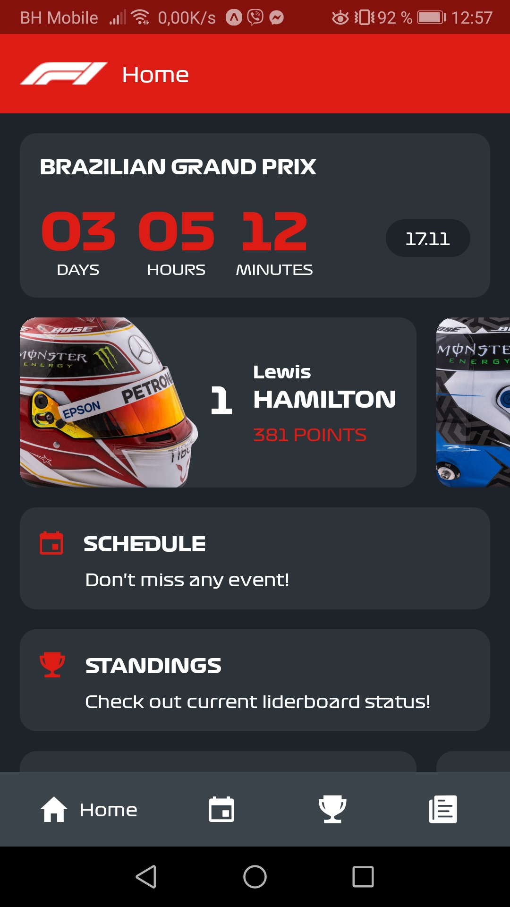

# React Native F1 Info App

Formula 1 Info App built with React Native and Expo. 
[Ergast Developer API](http://ergast.com/mrd/) is used as data source with some mock data.

*Note: This app is tested only on Android device*

### Quick start

```bash
# Clone repo

# Change directory to cloned app

# Install the dependencies with npm
$ npm install

# Start or restart a local server for app
$ expo start

# Open app in the Expo Client on a connected Android device.
$ expo android

# Open app in the Expo Client in an iOS simulator.
$ expo ios
```

## Preview




